# 대진의 하루 (daejins-today)
대진의 하루 (2010)
학교 소개 및 체험을 목적으로 한 체험형 퀴즈 게임 (Visual Basic)
   

게임 화면
--

- 시작 화면

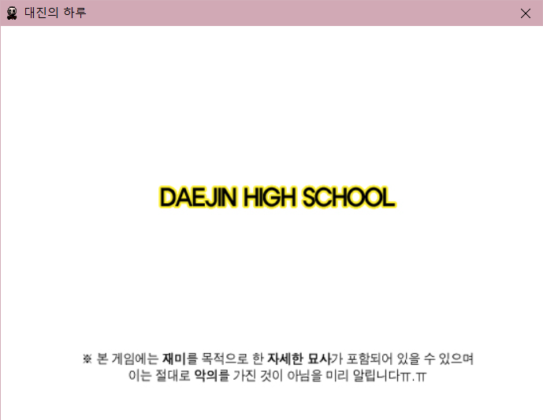

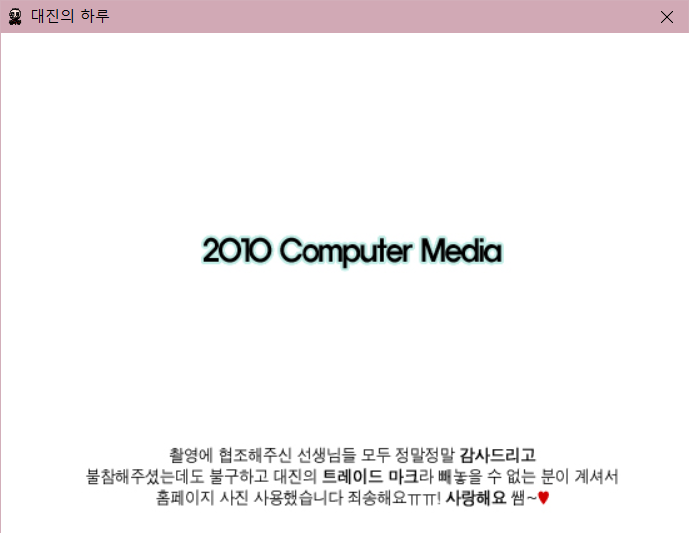

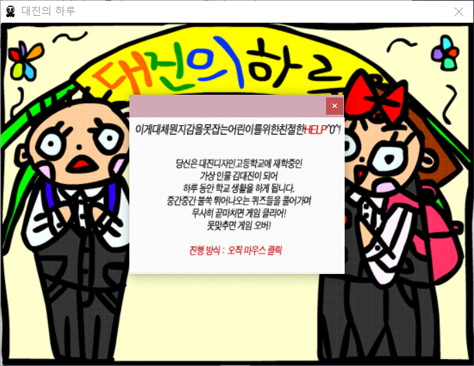

- 게임 화면

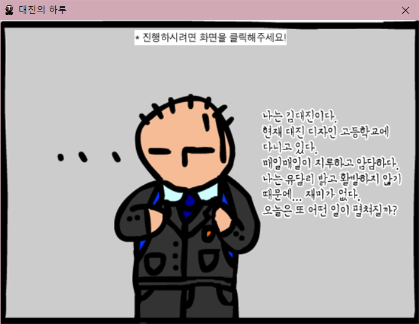

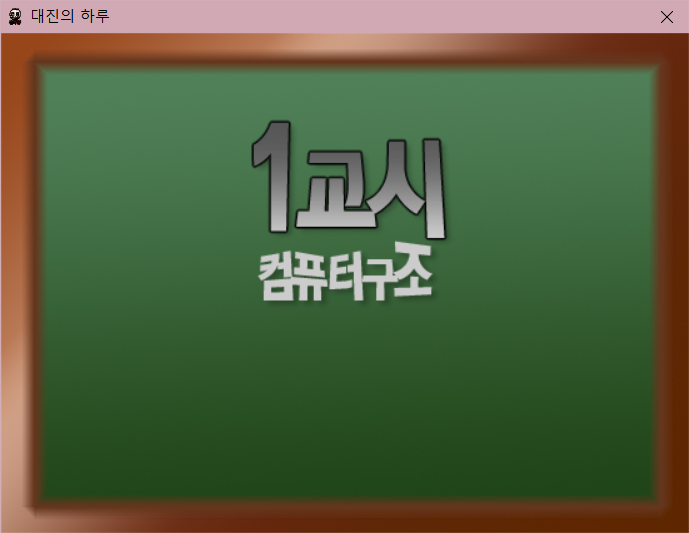
 *교시(스테이지) 시작*

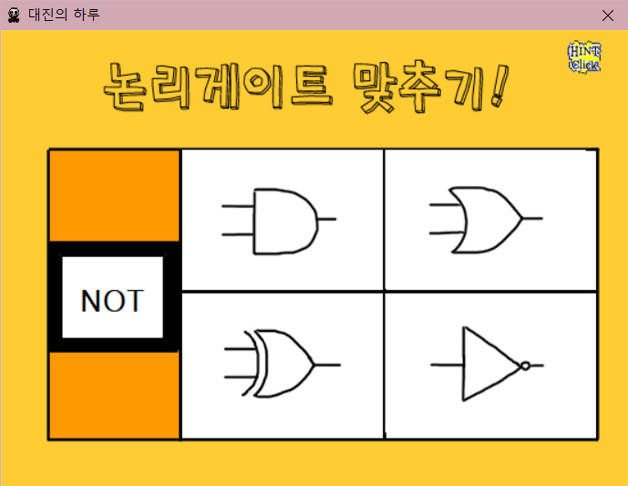
 *퀴즈 화면*

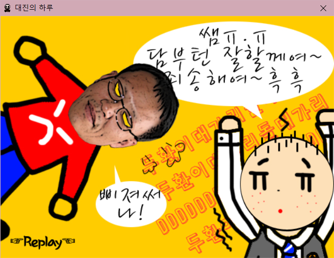
 *답이 틀렸을 시*

 *해당 교시의 모든 퀴즈를 맞췄을 시*

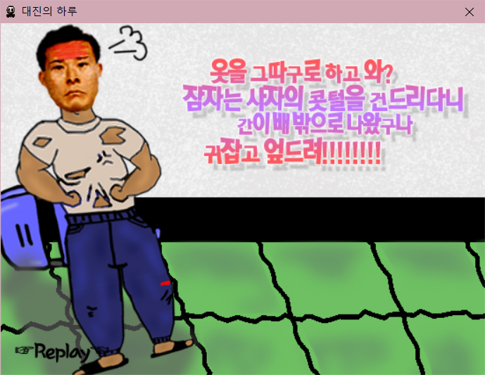

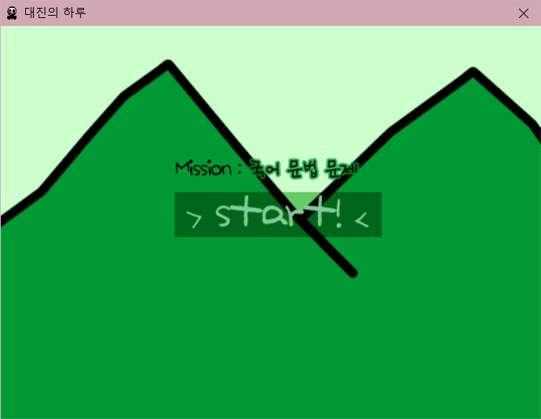

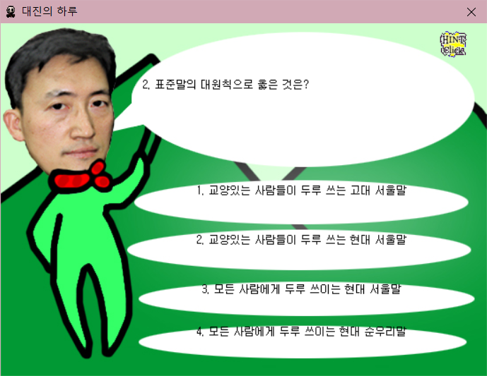

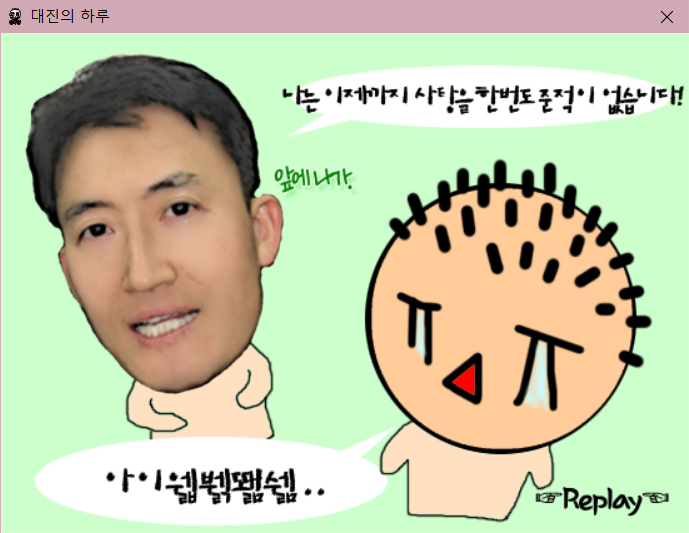

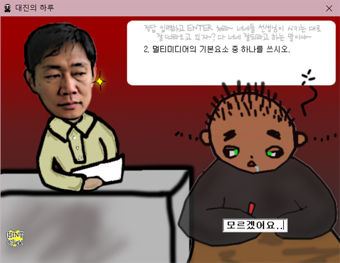

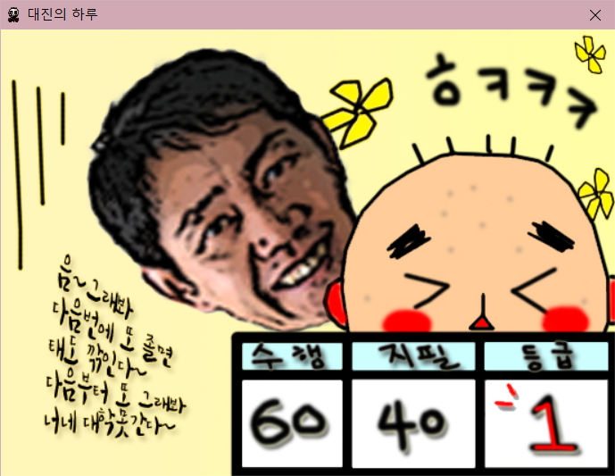

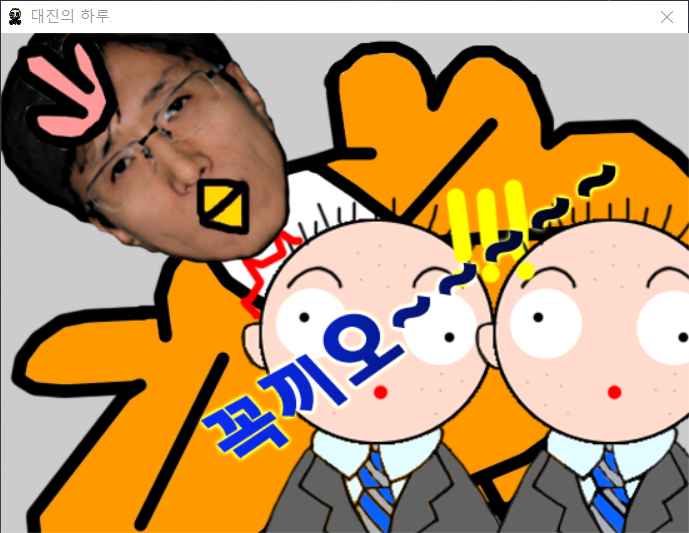

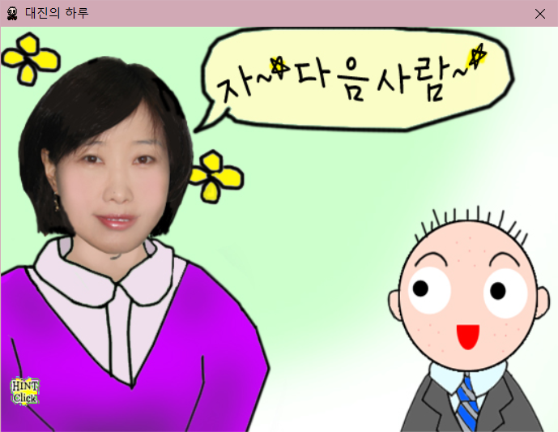

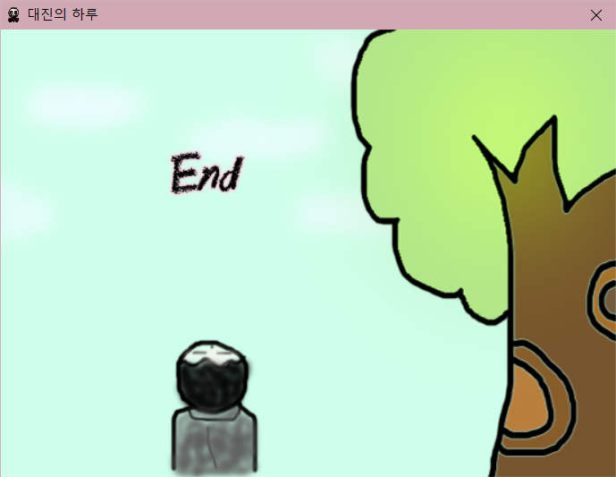

- 프로젝트 팀원 정보

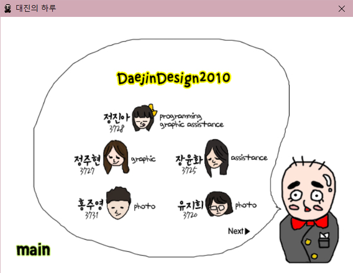

